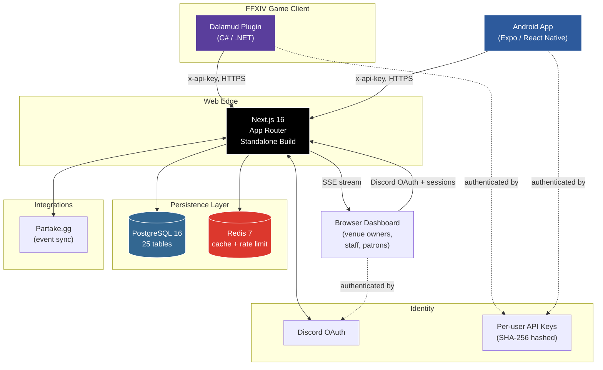

<div align="center">

# XIV Venue Manager
### Production venue management for an MMO community

[](https://nextjs.org)
[](https://www.typescriptlang.org)
[](https://www.postgresql.org)
[](https://github.com/goatcorp/Dalamud)
[](https://xivvenuemanager.com)

**Live:** [xivvenuemanager.com](https://xivvenuemanager.com) · **Built by** Ehno (`@BluntEXE`)

</div>

---

## TL;DR

A two-part venue management system for **Final Fantasy XIV** social venues: a **C# game-client plugin** that captures in-game events (patron arrivals, staff shifts, sales) and a **Next.js web dashboard** that aggregates them into analytics, payroll, and live attendance views. An Android companion app extends staff actions to mobile. The whole stack replaced spreadsheets and Discord pings.

```
┌──────────────────┐       ┌──────────────────┐       ┌──────────────────┐
│  FFXIV client    │  HTTP │  Web app + API   │  SQL  │   PostgreSQL     │
│  + Dalamud       ├──────►│  (Next.js 16)    ├──────►│   25 tables      │
│  + my plugin     │  SSE  │  + Redis cache   │       │                  │
│  (4,975 LOC C#)  │◄──────┤  (32,224 LOC TS) │       │                  │
└──────────────────┘       └──────────────────┘       └──────────────────┘
        ▲                          │ HTTP
        │                          ▼
   venue staff              browser dashboard
   (in-game)              (owners + analytics)
                                   │ HTTP
                                   ▼
                          ┌──────────────────┐
                          │  Android app     │
                          │  (Expo/RN)       │
                          │  (2,642 LOC TS)  │
                          └──────────────────┘
```

| | |
|---|---|
| **Lines of code** | ~40,000 (32,224 TS web + 2,642 TS mobile + 4,975 C#) |
| **API routes** | 81 |
| **Database tables** | 25 |
| **Commits** | 221 over ~6 months |
| **Knowledge-graph nodes** | 1,054 entities, 204 communities |
| **Solo built** | Yes - every line, every decision |

---

## The Problem

FFXIV has a thriving "venue" subculture: player-run nightclubs, lounges, and social spaces hosting live events. Operators were tracking everything - patron attendance, staff shifts, sales, tips, payroll - in **Google Sheets and Discord pings**. Every venue reinvented the same broken wheel.

Specific pain points that drove the build:

1. **Patron tracking** was manual: a host stood at the door typing names into a spreadsheet
2. **Shift/payroll** was eyeballed: staff posted "I worked 4 hours" in Discord and hoped for the best
3. **Analytics** didn't exist: no one knew which events drew traffic, which services sold, what staffing levels were needed
4. **Cross-venue mobility** was impossible: a bartender working at three different venues had no portable record of their hours

FFXIV exposes plugin APIs through the **Dalamud** framework. A plugin can observe game events directly (zone changes, party adds, chat messages, target focus) and report them somewhere structured. Pair that with a web app and you replace the spreadsheet-and-prayer workflow with real software.

---

## The Solution

A two-tier system, each tier doing what it's good at.

### Tier 1: Dalamud plugin (C#, ~5k LOC)
- Runs inside the FFXIV game client
- Observes patron arrivals/departures via zone-change + party events
- Provides chat commands (`/xvenue`, `/xvm`, `sale!`, `target!`) for instant logging without leaving the game
- Tracks staff shifts (clock-in/out)
- Authenticates to the web app via per-user API key

### Tier 2: Web app (Next.js 16 + PostgreSQL, ~32k LOC)
- 81-route REST API: plugin-facing routes (API key auth) + dashboard routes (Discord OAuth)
- Live page with **server-sent events** (SSE) for real-time patron flow
- Analytics dashboards per venue
- Payroll generation from shift + sales data
- Staff clock-in/out with manager override
- Multi-venue, multi-role permission model
- [Partake.gg](https://partake.gg) event sync integration

### Android companion app (Expo/React Native, ~2.6k LOC)
- Staff clock-in/out for active shifts
- Service sale logging
- Covers staff who aren't running the game client

### Design principle
> The plugin is the **primary action surface**. The website is the **fallback + analytics surface**.
> Players are already in the game, in the venue, busy. The plugin lets them act in 1-2 keystrokes; the website is where they review, configure, and analyze.

This project was built with AI tooling throughout. Claude Code assisted with architecture decisions, code generation, security review, and documentation. Every decision, deployment, and line of judgement is mine - AI compressed the execution time, not the thinking.

The platform wasn't opened to real users until it was production-ready and secure. The security audit ran before anyone depended on it. Shipping something unsafe to a community that trusts you with their data isn't a trade-off worth making.

---

## Architecture at a Glance



**Key flows:**
- **Patron logging:** Plugin detects game-side patron arrival, POSTs to `/api/plugin/patron-visits`, server dedupes (60s window), classifies as staff vs patron via active shift, attributes to active event, publishes to SSE bus, live dashboard updates without polling
- **Authentication split:** Two separate auth surfaces because the audiences differ. Plugin and mobile clients (machine-to-machine) use rotatable API keys with hashed storage. Browser clients use Discord OAuth via NextAuth.
- **Caching:** Redis sits between Next.js and Postgres for hot reads (venues, services, transactions). Same Redis instance backs rate limiting via separate key namespaces (`cache:` vs `rl:`).

---

## Tech Stack & Why

| Layer | Choice | Why this and not the alternative |
|---|---|---|
| **Frontend framework** | Next.js 16 App Router | Server Components mean dashboard data joins happen on the server, no waterfall fetches. Standalone build keeps the production image lean. |
| **Language** | TypeScript with `strict: true` | The plugin-to-server contract is the single most important interface in the system. A typed contract catches drift at build time, not in production. |
| **Database** | PostgreSQL 16 | Relational because the domain is relational: venues have memberships, memberships have shifts, shifts have transactions. Joins, not document gymnastics. |
| **ORM** | Prisma | Generated types feed the TS strictness. Schema-first migrations force thinking about data shape before writing routes. |
| **Caching + rate limiting** | Redis 7 (single instance, ioredis client) | One container, two key namespaces. `allkeys-lru` so cache evicts under pressure but rate-limit keys (1-min TTL) never get squeezed out. |
| **Auth (browser)** | NextAuth + Discord OAuth | FFXIV's social fabric runs on Discord. Forcing users into a second account would have killed adoption. |
| **Auth (plugin/mobile)** | Hashed API keys (SHA-256, 32-char nanoid) | Plugin and mobile clients can't do an OAuth dance. Keys are hashed at rest with `keyHash` lookups, never plaintext. |
| **Real-time** | Server-Sent Events | Unidirectional (server to browser) is enough for live patron flow. WebSockets would be overkill, and SSE survives proxy/CDN setups better. |
| **Game client** | Dalamud framework, C# / .NET | Standard FFXIV plugin runtime. C# bindings for game state are the only realistic option. |
| **Mobile** | Expo / React Native | Shared TS codebase with the web app's types. Staff already had Android devices; iOS deferred for cost, not technical reasons. |
| **Deployment** | Docker Compose on a self-hosted Linux server | Solo project: managed Kubernetes adds failure modes I don't need. Compose is reproducible, debuggable, and survives reboots. |
| **CI/CD** | GitHub Actions for lint + `npm audit`; manual deploy via SSH | Solo project: full continuous deployment isn't worth the failure modes when I'm the only one shipping. |
| **Schema migrations** | `prisma db push` (not migrations) | A solo, small-data project: schema iterates faster than migration files. Documented trade-off - would change at multi-engineer scale. |

---

## Three Engineering Vignettes

Real decisions, real trade-offs. Picked because they show range: cross-platform contract design, production security work, and a non-obvious real-time choice.

### Vignette 1: A C# plugin and a TypeScript server, talking

The plugin and web app are written in different languages, run on different machines, owned by different runtimes (game client vs. server). They have to agree on every payload byte or things break silently in production.

A naive approach has the plugin POST raw JSON, the server parse it loosely, and any field rename roll out as a silent compatibility break for every plugin user. They can't auto-update because plugins ship as zipped binaries, so the break sits there until someone notices something wrong in production.

The approach I took was to treat the plugin-to-web HTTP contract as a versioned API surface, not an internal call. Every plugin-facing route lives under `/api/plugin/*` and is treated as public-stable. Field additions are always additive and optional; field removals require a plugin release with a deprecation window. The plugin pins a base URL and an API key, nothing else - no client SDK, no generated types, just HTTP + JSON. Payload validation on the server is lenient on read (unknown fields ignored) and strict on write (known fields type-checked).

The cost: the API surface stays small on purpose. There are 12 plugin-facing routes out of 81 total, and I'm careful about adding more. Each one is a permanent commitment. A loose contract optimizes for shipping speed; a strict one optimizes for upgrade safety. With binary plugin distribution and no way to force-update users, the strict approach was the right call.

---

### Vignette 2: A real security audit, with deferrals

Six months in I ran a full security audit against the production app. A line-by-line review against an actual checklist. **18 findings:** 4 Critical, 6 High, 7 Medium, 5 Low.

**What got fixed (highlights):**
- **API keys hashed at rest** (was: plaintext in DB). Migration was non-trivial because existing keys had no `keyHash`; would have logged out every plugin user mid-session.
- **Secrets out of `docker-compose.yml`** and out of the Docker image (was: `COPY .env .env` baked secrets into image layers)
- **Rate limiting on all plugin + dashboard routes** with Redis-backed sliding-window
- **IDOR fix on feedback endpoint** (was: GET by ID, no scoping; now: scoped to `session.user.id`)
- **40 venue queries gained `status: "active"` membership filter** (was: revoked staff retained read access)
- **Cron auth made timing-safe** with constant-time comparison
- **SSH password auth disabled**, ed25519 keys only

**What got intentionally deferred, with rationale:**
- **Strict CSP:** initially deferred given low threat model, later completed (2026-05-07) - nonce-based CSP with `unsafe-eval`/`unsafe-inline` removed, implemented via per-request nonce generation in `proxy.ts`
- **Database password rotation:** the password was weak but the database isn't externally exposed; rotated when convenient, not as fire-drill
- **Invite token venue-name leak:** non-issue - anyone joining will see the venue name regardless

Documenting every deferred item with the reason it was deferred and the trigger that should bring it back matters more than claiming everything is fixed. "I fixed everything" is less useful than knowing which things you chose not to fix and why.

**The bug I shipped on top of the audit:**
Even after the audit declared rate limiting "fixed," a test exposed an ordering bug: the rate limit ran *after* API-key validation. Bad or missing keys returned 401 before any counter incremented, leaving the keyspace open to unthrottled brute-force probing - each attempt costing a database lookup. Fixed by adding a per-IP pre-filter that runs **before** key validation. Verified: 80-request burst from one IP gave 60x 401 + 20x 429.

Audits check whether a control exists. They don't check whether it's positioned to do its job.

---

### Vignette 3: Real-time without WebSockets

The live page (`/dashboard/<venue>/live`) shows patrons entering and leaving in real time, as the plugin reports them. First instinct was WebSockets. After thinking it through: **Server-Sent Events.**

Traffic is unidirectional - the server pushes events to the browser, the browser never sends back. SSE rides on plain HTTP/1.1, no protocol upgrade dance, no special proxy config, and works through every reverse proxy I'd deploy behind. The native `EventSource` API handles reconnection without a client library. One open HTTP/2 connection per viewer, idle 99% of the time.

The architecture is straightforward:
```
plugin POST /api/plugin/patron-visits
  └─► server validates, dedupes, classifies
      └─► writes row to PatronLog (Postgres)
          └─► emits to in-process venueEventBus (per-venue channel)
              └─► every connected SSE client for that venue receives the event
                  └─► browser appends row to live feed without reload
```

The bus is in-process per Node container. With one replica that's fine. Going multi-replica would require swapping the bus for Redis pub/sub, which is a documented future migration (Redis is already provisioned, so it's a 50-line change when needed, not a re-architecture).

The cost: SSE doesn't survive a server restart - connections drop and the browser reconnects. For a live patron feed, that's a sub-second blip nobody notices. For a chat app it would be unacceptable. SSE fits when traffic is unidirectional and you can tolerate brief reconnect blips. WebSockets fit when you need bidirectional push or rich session protocols.

---

## What I'd Do Differently

1. **Write the plugin-to-web contract as a typed schema first.** Today the contract is implicit in route handlers and hand-coded plugin DTOs. A shared OpenAPI or `zod`-derived schema would cut the chance of silent drift to near zero. One extra build step; worth it from day one in any future project.
2. **Start with Prisma migrations, not `db push`.** Today's schema is at 25 tables. Iterating with `db push` was fast early; today every schema change is an audit-trail gap reconstructed from git. The trade-off was right for week one and wrong for week 26.
3. **Wire cache observability in from the start.** There are rate-limit metrics (Redis `INFO`), but no per-namespace cache hit/miss counters. Adding them later is harder than adding them when writing the cache layer.
4. **Design payroll generation as event-sourced, not query-derived.** Today payroll is computed by querying shifts + transactions. Worked until I needed retroactive shift edits. An event-sourced approach (immutable log of timecard events, projected into payroll periods) would handle history-rewrites cleanly.

---

## By the Numbers

<div align="center">

| Metric | Value |
|---|---|
| Total LOC | ~40,000 |
| Web app (TS/TSX) | 32,224 |
| Mobile app (TS/TSX) | 2,642 |
| Plugin (C#) | 4,975 |
| API routes | 81 |
| Database tables | 25 |
| Plugin-facing routes | 12 |
| Web-only routes | 57 |
| Mobile-facing routes | 12 |
| Cron jobs | 4 |
| Commits | 221 |
| Active development span | ~6 months (Dec 2025 - May 2026) |
| Production environment | Single self-hosted Linux box |
| Container count | 7 (web, postgres, redis, cron, xiv-stats, adminer, static-ehno) |
| Redis memory ceiling | 256 MB (`allkeys-lru`) |

</div>

---

## Limitations & Roadmap

**What it doesn't do (yet):**
- No multi-region deployment - single box, single region
- No iOS app - Android companion app ships (Expo/React Native, Play Store); iOS deferred (cost)
- No public API for third parties - `/api/plugin/*` is for the official plugin only
- No marketplace / cross-venue discovery - venues are isolated tenants
- No automated database backups beyond manual nightly tarballs

**What's in the queue (deferred-with-trigger):**
- Cache stampede protection + observability (deferred until traffic justifies)
- Multi-replica web tier (would require swapping in-process event bus for Redis pub/sub)

**What I'd build next if this were a job:**
- iOS companion app (Android shipped; deferred for cost, not technical reasons)
- Public read API for venue listings (with rate-limited keys)
- Per-venue custom branding so each venue feels distinct
- Slack / Discord webhook integrations for shift notifications

---

## Repos & Live Surfaces

- **Web app source:** [github.com/BluntEXE/ffxiv-venue-manager](https://github.com/BluntEXE/ffxiv-venue-manager)
- **Live production:** [xivvenuemanager.com](https://xivvenuemanager.com)
- **Plugin distribution:** Released as a [Dalamud third-party repo](https://github.com/goatcorp/Dalamud) (binary zips, auto-updated by the Dalamud installer)

For a deeper engineering walkthrough see [`apps/web/docs/engineering/`](./apps/web/docs/engineering) - broken into:
- [Architecture](./apps/web/docs/engineering/architecture.md) - system diagram, component responsibilities, data flow
- [Security](./apps/web/docs/engineering/security.md) - full audit narrative, what was fixed, what was deferred and why
- [Scaling](./apps/web/docs/engineering/scaling.md) - Redis + rate limit decisions, what changes at 10x and 100x

---

<div align="center">

*Built solo by **Ehno** (`@BluntEXE` on GitHub).*
*FFXIV character "Ehno" credited as plugin author; GitHub handle "BluntEXE" used for code.*

</div>
