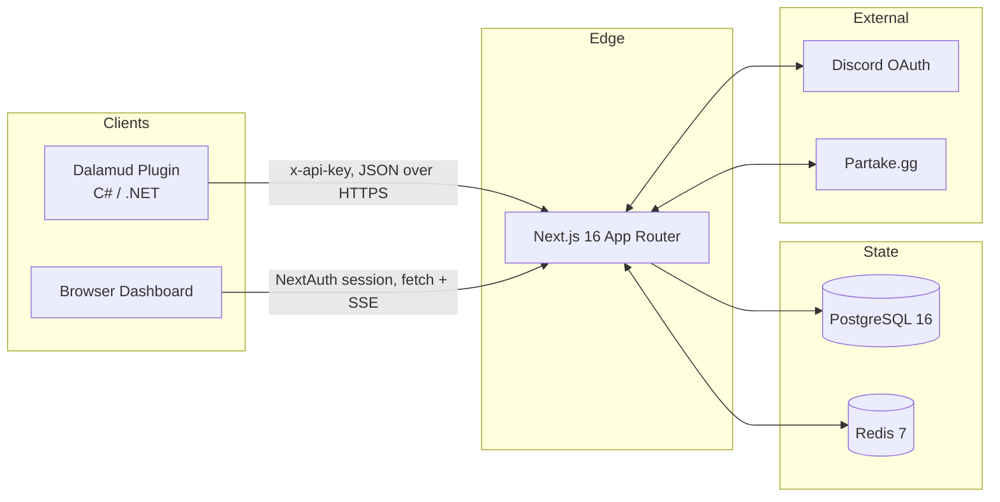
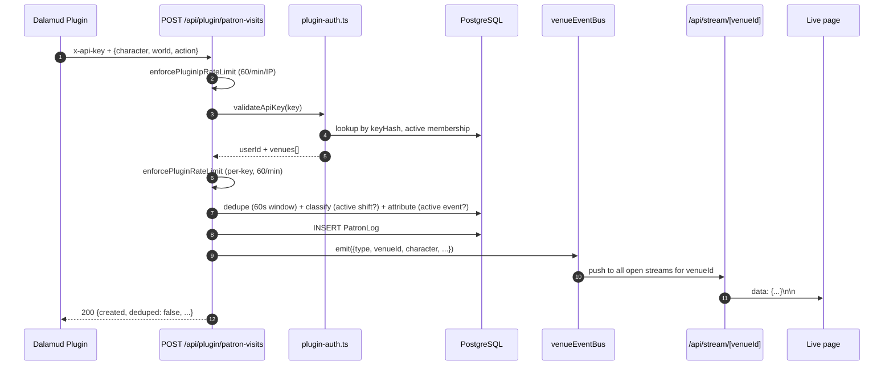

# Architecture

> Companion to [CASE_STUDY.md](../../CASE_STUDY.md). The case study summarizes; this doc walks the actual implementation.

## System overview

Two clients (FFXIV game plugin, web browser) talk to one Next.js application backed by Postgres and Redis. Single-region, single-replica, self-hosted on Linux + Docker Compose.



## Repository layout

```
xiv-app/
├── app/                          # Next.js App Router
│   ├── api/
│   │   ├── auth/[...nextauth]/   # NextAuth catch-all (wrapped with rate limit)
│   │   ├── plugin/               # Plugin-facing API (12 routes, x-api-key auth)
│   │   ├── venues/               # Dashboard API (43 routes, session auth)
│   │   ├── admin/                # Admin-only routes
│   │   ├── cron/                 # 4 scheduled jobs (cron-auth secret)
│   │   ├── stream/[venueId]/     # SSE endpoint for live page
│   │   └── ...
│   ├── dashboard/                # Browser dashboard pages
│   ├── auth/                     # Sign-in / error pages
│   └── invite/                   # Invitation accept flow
├── components/                   # React components (shadcn/ui based)
├── lib/
│   ├── api/                      # Server-side helpers (plugin-auth, plugin-rate-limit)
│   ├── middleware/               # withRateLimit, withVenueAuth
│   ├── sse/                      # In-process event bus for live updates
│   ├── auth.ts                   # NextAuth options
│   ├── prisma.ts                 # Shared PrismaClient singleton
│   ├── redis.ts                  # Shared ioredis singleton
│   ├── rate-limit.ts             # Sliding-window limiter (uses lib/redis)
│   └── redis-cache.ts            # Cache-aside layer (uses lib/redis)
├── prisma/schema.prisma          # 19 models
└── docker-compose.yml            # web + postgres + redis + cron + static
```

## Data model summary

19 Prisma models. The five anchors:

| Model | Role |
|---|---|
| `User` | Account identity (Discord-linked via NextAuth `Account`) |
| `UserCharacter` | Maps an FFXIV character (name + world) to a user. One user can have many characters. |
| `Venue` | The tenant boundary. Almost everything else has `venueId`. |
| `Membership` | Many-to-many between User and Venue, with role + status. The fundamental authorization record. |
| `ApiKey` | Plugin credentials, hashed at rest as `keyHash`. |

Auxiliary models layer on top: `Event`, `Shift`, `PatronLog`, `Transaction`, `Service`, `Role`, `Task`, `PayrollEntry`, `Webhook`, `Feedback`, `EventTemplate`, plus NextAuth's `Session` and `VerificationToken`.

## Authentication: two surfaces, two strategies

The plugin and browser have different threat models, so they use different auth.

### Browser: NextAuth + Discord OAuth
- All dashboard routes are session-protected via `getServerSession(authOptions)`
- Sessions are JWT-strategy, 7-day max age, refreshed every 24 hours
- The whole `/api/auth/[...nextauth]` catch-all is wrapped to throttle `signin` and `callback` paths to 10/min/IP. Polled paths (`/session`, `/csrf`) are exempt because the NextAuth client polls them aggressively for legit refresh.

### Plugin: hashed API keys
- Generated as `vm_<32-char nanoid>` (192 bits of entropy)
- Stored as `SHA-256(key)` in the `ApiKey.keyHash` column. Plaintext is never persisted in lookups.
- Plugin sends `x-api-key: vm_...` header on every request
- Server validates: hash incoming, lookup `keyHash + revokedAt: null + active membership`
- Per-IP rate limit runs *before* `validateApiKey()` so brute-force probing is throttled at 60/min/IP regardless of header validity (see [security.md](./security.md))

### Cron: timing-safe Bearer
- `Authorization: Bearer <CRON_SECRET>` against a constant-time comparison via `crypto.timingSafeEqual`
- Prevents timing-based secret extraction; matters because the cron container hits localhost over docker-compose network

## The plugin contract

The plugin↔web HTTP surface is the most stability-sensitive interface in the system. Plugins ship as binary zips; users can't auto-update them. Field renames are silent compatibility breaks.

Discipline applied:
1. **Plugin-facing routes live under `/api/plugin/*`** and are treated as a public-stable surface (12 routes total)
2. **Lenient on read, strict on write**: server ignores unknown fields in incoming payloads, type-checks known ones
3. **Additive evolution only**: new fields are always optional, removals require a deprecation window
4. **No client SDK** - plugin pins base URL + API key, sends raw JSON. Eliminates a generated-code drift surface.

## Sequence: patron-visit lifecycle

The single most important data flow. Triggered when a patron walks into a venue in-game.



Three subtle pieces:
- **Dedupe**: 60s sliding window on `(venueId, character, world, action)`. Multiple staff plugins observing the same arrival collapse to one row.
- **Classification**: a character is "working" only if their linked user has an `ACTIVE` shift at this venue right now. Off-duty staff log as patrons (the "visit-as-friend" case).
- **Event attribution**: snapshotted to `eventId` at log time, so later event reschedules don't retro-rewrite history.

## Real-time delivery: SSE

The live page (`/dashboard/<venue>/live`) shows arrivals as they happen. Implementation:

- `lib/sse/venue-events.ts` exposes a per-process `EventEmitter` keyed by `venueId`
- Routes that mutate patron state (`logPatronVisit`, plus a few others) call `venueEventBus.emit(venueId, event)`
- `/api/stream/[venueId]/route.ts` opens a long-lived `text/event-stream` response, attaches a listener, writes events as `data: {...}\n\n`
- Browser uses the native `EventSource` API; no client library

Trade-offs:
- **In-process bus is single-replica.** Multi-replica web tier would need Redis pub/sub. Pre-provisioned (Redis is already there), so it's a 50-line swap when needed.
- **Connections drop on server restart.** Browser auto-reconnects. For sub-second blips this is acceptable; for chat it would not be.

## Caching layer

`lib/redis-cache.ts` uses the shared ioredis singleton. Six routes use it (cache-aside via `getOrSet`):
- `GET /api/venues` (a user's venues)
- `GET /api/venues/[venueId]`
- `GET /api/venues/[venueId]/services` + `[serviceId]`
- `GET /api/venues/[venueId]/transactions/[transactionId]`
- `lib/api/transactions.ts` (helper)

TTLs (`cacheTTL` in `lib/redis-cache.ts`):
- Venues: 5 min
- Venue settings: 10 min
- Memberships: 5 min
- Services: 10 min (low churn)
- Transactions: 3 min (higher churn)

Invalidation is explicit in mutating routes. `invalidateCache(cacheKeys.userVenues(userId))` runs after venue create/delete, etc.

## Cron jobs

Four scheduled jobs run from a separate `cron-jobs` container:

| Schedule | Path | Purpose |
|---|---|---|
| `*/5 * * * *` | `update-event-statuses` | Transition events between PUBLISHED → ACTIVE → COMPLETED based on time |
| `*/15 * * * *` | `event-reminders` | Send Discord webhook reminders before events |
| `0 * * * *` | `sync-partake-events` | Pull from Partake.gg API |
| `0 0 * * *` | `daily-sales-summary` | Aggregate previous day, post to webhook |

All four authenticate via `verifyCronAuth(request)` with constant-time comparison.

## Production deployment

- Single Linux box, `docker compose up -d`
- 5 containers: `venue-manager` (Next.js standalone), `postgres`, `redis`, `cron-jobs`, `static-ehno`
- Reverse proxy fronts the public URL (`xivvenuemanager.com`) and terminates TLS
- GitHub Actions runs lint + `npm audit --audit-level=high` on push and weekly cron
- Deploys are manual: SSH to server, `git pull`, `docker compose build venue-manager && docker compose up -d venue-manager`. Solo project; full continuous deployment isn't worth its failure modes when I'm the only shipper.

For the security model layered on this architecture, see [security.md](./security.md). For scaling considerations, see [scaling.md](./scaling.md).
